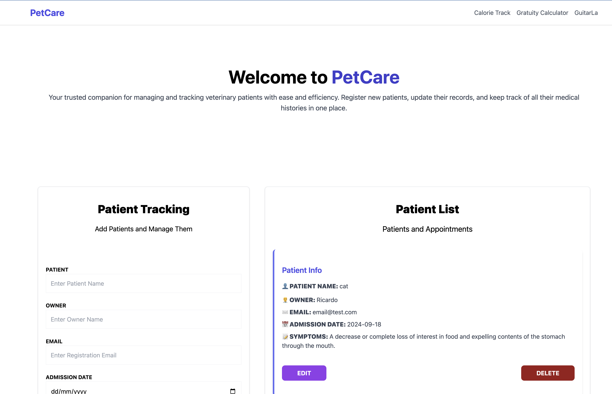

# PetCare

**[PetCare - Live Demo]()**



## Table of Contents
- [Description](#description)
- [Features](#features)
- [Technologies Used](#technologies-used)
- [Hooks Used](#hooks-used)
- [Installation](#installation)
- [Usage](#usage)
- [Contributing](#contributing)
- [License](#license)

## Description
PetCare is an intuitive application designed for veterinary clinics to streamline the process of managing patient information. Users can register and track details about patients, including their medical history, ensuring that all relevant information is readily available for quick reference and updates.

## Features
- Register new patients with detailed information.
- Edit and update patient information.
- View a list of registered patients.
- Easy navigation and data management for veterinary clinics.
- Real-time data updates with state management using Zustand.

## Technologies Used
- **React**: v18.3.1, a JavaScript library for building user interfaces.
- **TypeScript**: Adds static type checking to improve code quality.
- **Vite**: A fast build tool that offers a modern development experience.
- **Tailwind CSS**: v3.4.10, a utility-first CSS framework for rapid UI development.
- **react-hook-form**: For managing form state and validation.
- **Zustand**: For state management.
- **uuid**: For generating unique identifiers.
- **react-toastify**: For notifications and alerts.
- **Netlify**: A platform for deploying and hosting web applications.

## Hooks Used

### `useEffect`
`useEffect` is a React hook that allows you to perform side effects in function components, such as fetching data or updating the DOM. In this app, it is used to manage the lifecycle of component data and effects, such as loading patient information.

### `useForm`
`useForm` is a hook provided by `react-hook-form` for managing form state and validation. It simplifies form handling and ensures that data is correctly captured and validated before submission.

## Installation

To run the project locally, follow these steps:

1. Clone the repository:
    ```bash
    git clone https://github.com/RicardoTrejoSanjuan/petcare-app.git
    ```

2. Navigate into the project directory:
    ```bash
    cd petcare-app
    ```

3. Install dependencies:
    ```bash
    npm install
    ```

4. Start the development server:
    ```bash
    npm run dev
    ```

5. Open your browser and go to `http://localhost:5173` to access the application.

## Usage

1. Register new patients by filling out the required details.
2. Edit existing patient information as needed.
3. View the list of registered patients for quick access to their data.
4. Utilize the application's intuitive UI to streamline patient management.

## Contributing

Contributions are welcome. If you wish to improve this project:

1. Fork the repository.
2. Create a new branch (`git checkout -b feature/new-feature`).
3. Make your changes and commit them (`git commit -m 'Add new feature'`).
4. Push the branch (`git push origin feature/new-feature`).
5. Open a pull request.

## License

This project is licensed under the [MIT License](LICENSE).
